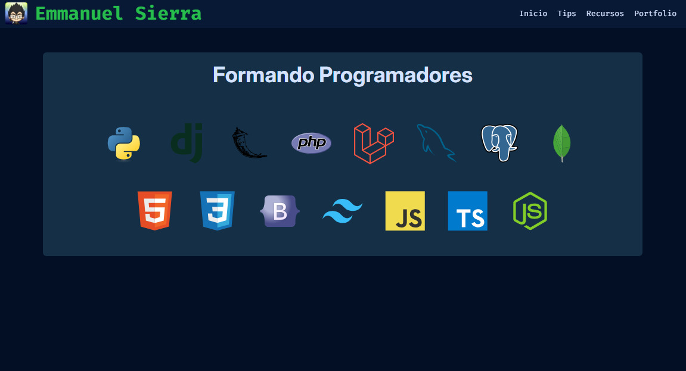

# Emmanuel Sierra WEB Page

WEB page with useful tips and resources for the development of GUI and WEB applications

To clone the repository:
 
<ul>
    <li>Locate in the folder where you want to place this repository</li>
    <li>Open the CMD command line in this folder and run:</li>
    <li>git clone https://github.com/esierr01/esierr01.github.io.git</li>
</ul>

<h4>Development: In Process</h4>

 

# 🌍 If you want to contact me :

